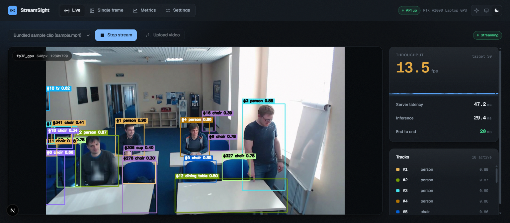
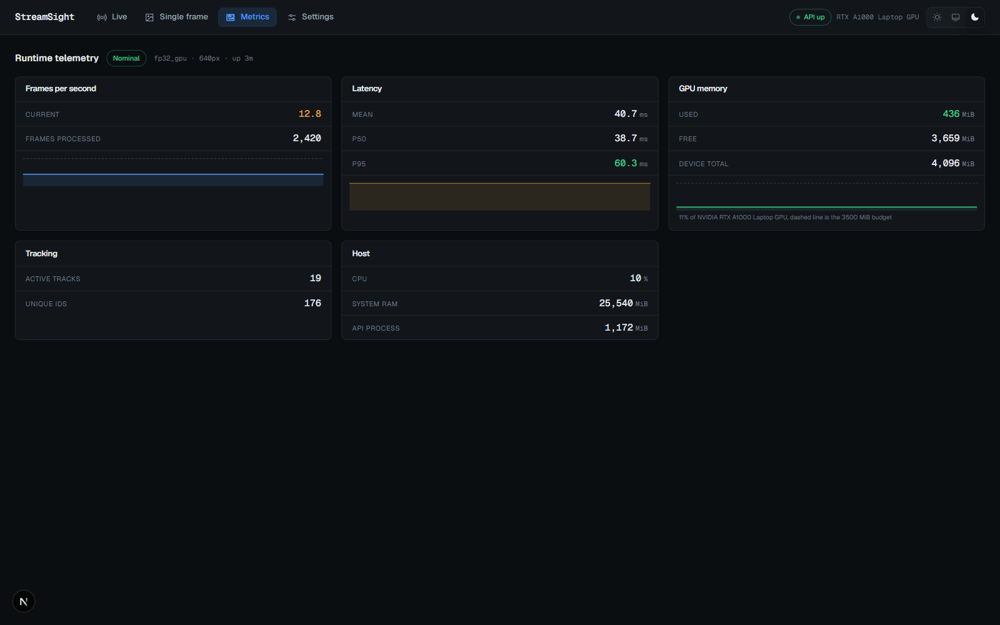
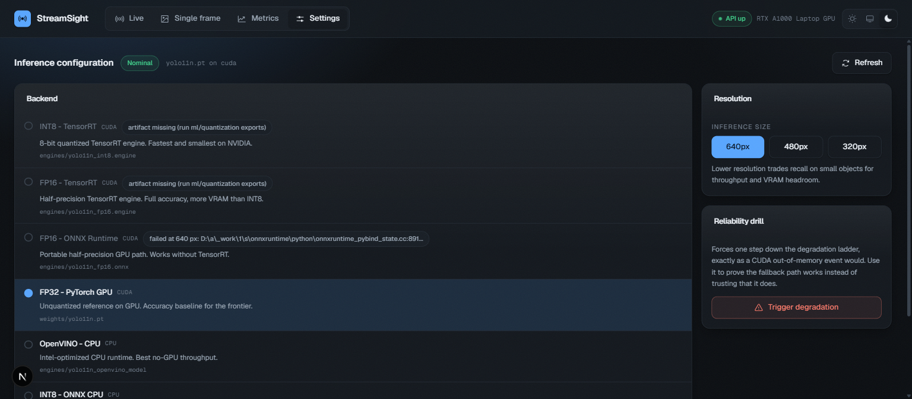
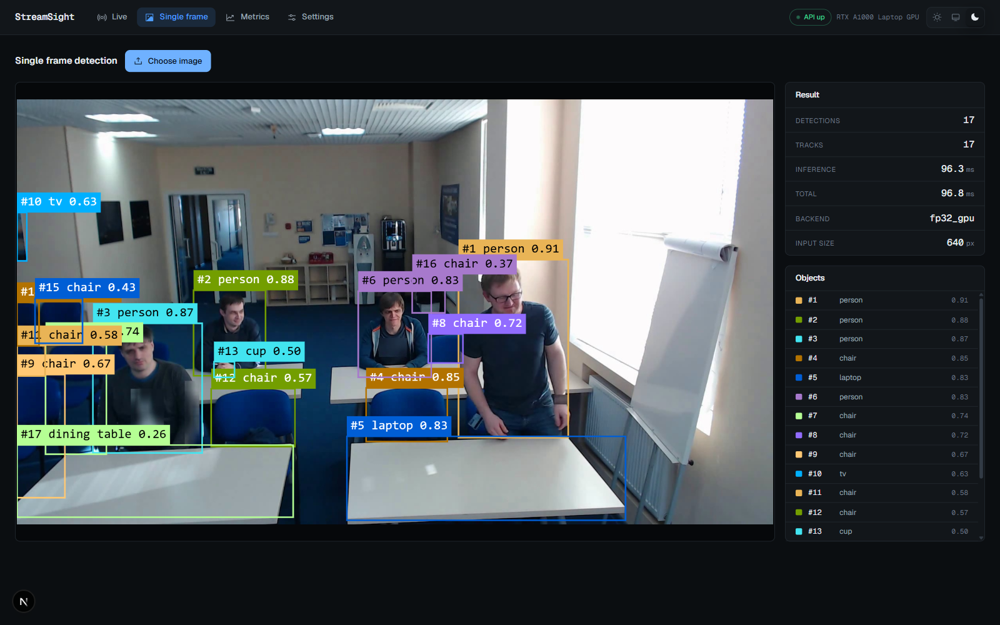
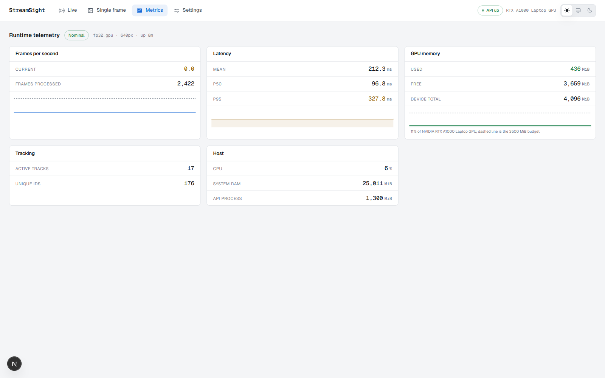

# StreamSight

Real-time object detection and multi-object tracking that runs inside a **4 GB laptop GPU**, with
an accuracy-throughput frontier and an edge-export path.

Upload a clip, point it at a webcam, or give it an RTSP URL. The API detects objects, assigns
persistent track ids, burns the overlay into the frame, and streams it to a browser console over a
WebSocket while reporting live throughput, latency percentiles and VRAM.



<details>
<summary>More screens</summary>

| | |
|---|---|
|  |  |
| Telemetry dashboard | Backend selector, with reasons for unavailable options |
|  |  |
| Single-image detection | Light theme |

</details>

## What it actually does

- **Detect and track in one pass.** YOLO11n plus ByteTrack via Ultralytics `model.track(...,
  persist=True)`, so identity association happens alongside detection rather than as a second stage.
- **Runs on 4 GB, and proves it.** Peak VRAM is **316 MiB** at 640 px against a 3.5 GB budget, and
  every telemetry panel shows the real figure rather than a claim.
- **Degrades instead of crashing.** On CUDA out-of-memory the runtime drops 640 -> 480 px, then
  steps down a backend ladder to CPU, flags `degraded_mode`, and says why. There is a button in the
  UI that triggers the whole path on demand, because a fallback nobody exercises is a fallback
  nobody can trust.
- **Swaps models without a restart.** Precision and resolution change under a lock while a stream is
  running.
- **Measures the trade-off.** A sweep across backends and resolutions produces a Pareto frontier of
  throughput against detection agreement with the FP32 baseline.

## Measured results

RTX A1000 Laptop GPU (4096 MiB), i9-12900H, 200 frames of 1080p footage, full pipeline
(decode + inference + tracking), not detector-only.

| Configuration | FPS | p95 latency | Peak VRAM | Recall vs FP32 | Artifact |
|---|---|---|---|---|---|
| FP32 PyTorch GPU, 640 px | **48.5** | 21.2 ms | 316 MiB | baseline | 5.35 MB |
| FP32 PyTorch GPU, 480 px | **71.7** | 14.9 ms | 306 MiB | 81.4% | 5.35 MB |
| FP32 PyTorch GPU, 320 px | **84.3** | 13.1 ms | 312 MiB | 57.2% | 5.35 MB |
| OpenVINO CPU, 640 px | **35.8** | 31.1 ms | n/a | 98.4% | 5.45 MB |
| INT8 ONNX CPU, 640 px | **15.1** | 72.6 ms | n/a | 93.3% | 4.36 MB |
| FP32 PyTorch CPU, 640 px | **15.4** | 71.7 ms | n/a | 100.0% | 5.35 MB |

Two results worth calling out:

- **OpenVINO on the CPU clears 30 FPS at 98.4% recall.** On this machine the GPU is not required to
  hit real-time, which is the opposite of what the design assumed going in.
- **INT8 is slower than FP32 on this CPU.** ONNX Runtime's quantized kernels lose to OpenVINO's
  optimized FP16 path here, so INT8 buys a 19% smaller artifact and costs throughput. It would still
  be the right choice on a memory-constrained target; it is the wrong one on this laptop. That is
  exactly the kind of answer the frontier exists to produce.

Full report: [`ml/eval/reports/frontier.md`](ml/eval/reports/frontier.md), with a plot at
`frontier.png` and machine-readable results in `frontier.json`.

### Accuracy: COCO mAP on the 6-class subset

Standard pycocotools mAP over the 2,968 val2017 images containing person/bicycle/car/motorcycle/
bus/truck, at the COCO protocol's `conf=0.001, max_det=100`:

| Backend | mAP50-95 | mAP50 | Drop vs FP32 |
|---|---|---|---|
| FP32 PyTorch GPU | **0.4211** | 0.6105 | baseline |
| OpenVINO CPU | **0.4211** | 0.6133 | 0.00 pp |
| INT8 ONNX CPU | **0.4172** | 0.6080 | **0.40 pp** |

**INT8 costs 0.40 points of mAP for a 19% smaller artifact**, against the PRD's 3.00-point gate.
The MLflow promotion gate reads exactly these reports and transitioned `streamsight-detector` v1
to Production on that basis. See [MLOPS](docs/MLOPS.md).

The **browser viewer** runs slower than the pipeline figures above, at roughly **13 FPS** on 1080p
source, because annotation, JPEG encoding and transport are on the critical path. End-to-end
send-to-paint latency is **~12 ms**. Both numbers are shown live in the console.

## Quick start

Requires Python 3.11, Node 20+, and (optionally) an NVIDIA GPU with a CUDA 12 driver. Without a
GPU everything still runs on the CPU path.

```powershell
git clone <this repo> streamsight
cd streamsight

python -m venv .venv
.\.venv\Scripts\Activate.ps1
pip install -r requirements.txt

# Model weights, the demo clip, and the held-out calibration clip
python ml/scripts/fetch_assets.py

# Optional: export the quantized and CPU-optimized backends
python ml/quantization/export_engines.py --formats fp16_onnx openvino_cpu
python ml/quantization/calibrate.py

# API on :8100
cd apps/api
python -m uvicorn app.main:app --port 8100
```

In a second shell:

```powershell
cd apps/web
npm install
npm run dev     # http://localhost:3100
```

Open <http://localhost:3100>, pick the bundled clip, and press **Start stream**.

## Architecture

```
video source ──> capture thread ──> ring buffer ──> inference runtime ──> annotate ──> JPEG ──> WebSocket ──> canvas
  file/webcam/     downscale to      drop-oldest      YOLO11n + ByteTrack    burn in      encode      :8100        :3100
  RTSP             1280 px           depth 30         backend ladder         overlay
```

- **`apps/api`** FastAPI. `routers/` handle transport, `runtime.py` is the single owner of the
  loaded model, `backends.py` is the declarative registry every other layer agrees on.
- **`apps/web`** Next.js 15 console with a first-class light and dark theme.
- **`ml/`** export, calibration, benchmarking and frontier analysis.

**Full technical write-up:** [`docs/technical-deep-dive.md`](docs/technical-deep-dive.md) — design
decisions with their reasoning, the quantization findings, the performance work, and the honest gaps.

| Doc | Covers |
|---|---|
| [ARCHITECTURE](docs/ARCHITECTURE.md) | data flow, and why each piece is shaped the way it is |
| [API_REFERENCE](docs/API_REFERENCE.md) | every endpoint, payload, and the precision vocabulary |
| [INFERENCE_GUIDE](docs/INFERENCE_GUIDE.md) | setup, backend ladder, VRAM budget, troubleshooting |
| [QUANTIZATION](docs/QUANTIZATION.md) | calibration, the INT8 findings, per-target fit matrix |
| [BENCHMARKS](docs/BENCHMARKS.md) | how the frontier is measured, and its caveats |
| [DATASETS](docs/DATASETS.md) | COCO/MOT download, integrity policy, the MOT registration gate |
| [TRAINING_GUIDE](docs/TRAINING_GUIDE.md) | the Colab fine-tune, resume story, LOCAL vs CLOUD |
| [MLOPS](docs/MLOPS.md) | tracking server, model registry, the promotion gate |
| [DEPLOYMENT](docs/DEPLOYMENT.md) | local run, Docker, ports, environment variables |

## Stack

| Layer | Choice | Version | Why |
|---|---|---|---|
| Detection + tracking | Ultralytics YOLO11n, ByteTrack | 8.4.104 | One call for detect and associate; 2.6 M params fits trivially in 4 GB |
| GPU runtime | PyTorch CUDA | 2.3.1 + cu121 | Matches the installed CUDA 12 driver line |
| CPU runtime | OpenVINO | 2024.6.0 | Fastest CPU path measured here by a factor of two |
| Quantization | ONNX Runtime static QDQ | 1.18.1 | Real INT8 with calibration, not a rename |
| API | FastAPI, uvicorn | 0.115.0 | Native WebSocket, typed request and response models |
| Frontend | Next.js, React, Tailwind | 15.5, 19, 4.1 | App Router, CSS-variable theming |
| Quality | pytest, ruff, black, Playwright | - | 129 tests (115 API + 14 ML), 5 browser E2E |

## Tests

```powershell
python -m pytest -q                    # 129 tests, incl. a real model and a live WebSocket
python -m ruff check apps/api ml
cd apps/web && npm run typecheck && npx playwright test
```

The browser E2E suite asserts on behaviour, not markup: that the canvas receives pixels which keep
changing, that the FPS readout leaves zero, that the theme toggle restyles the document and
survives a reload.

## Known limitations

- **TensorRT engines are not built.** TensorRT 10 has no installable Windows wheel, and TensorRT 11
  removed the API Ultralytics uses, requiring NVIDIA ModelOpt which in turn wants torch >= 2.8. The
  registry, the export script and the UI all support TensorRT; the artifacts are simply absent on
  this machine, and the frontier reports them as unavailable rather than pretending otherwise.
- **FP16 ONNX on GPU does not load here.** ONNX Runtime needs cuDNN 8 on `CUDA_PATH`; the installed
  CUDA 12.0 toolkit does not ship it. The runtime detects this at warmup, records the reason, and
  shows it in the model selector.
- **Exported graphs are shape-fixed.** An artifact exported at 640 px cannot serve 480 px, so
  resolution sweeps only apply to the PyTorch backends. This is surfaced in the UI, not hidden.
- **Single-viewer by design.** One model instance means one ByteTrack identity table, so a second
  browser tab or a single-frame upload during a live stream perturbs that stream's track ids.
  Fixing it properly means per-session tracker state, which is Phase 7 work. For the intended use
  (one operator, one screen) it is not a problem, but it is a real constraint, not an oversight.
- **No authentication.** Local single-user demo. `POST /config/degrade` and `POST /config/model`
  are unauthenticated and take no body, so do not expose this to a network you do not control.
- **No fine-tuning yet.** The model is pretrained COCO. `ml/scripts/train_colab.py` is written and
  resumable but has never been executed: it needs a Google account and a free T4 session.
- **No MOT17 tracking metrics.** `ml/eval/eval_mot.py` is written and unit-tested, but MOTChallenge
  is registration-gated and cannot be fetched unattended. Supply the zip to
  `ml/data/scripts/download_mot.py --zip` and MOTA/IDF1/IDSW follow.
- **The MLflow registry is advisory.** The gate registers and promotes, but the API resolves
  artifacts from fixed paths and has no MLflow code. Promotion records a decision; it does not
  change what serves. See [MLOPS](docs/MLOPS.md).

## License

MIT.

Phu Nguyen - HCMC, Vietnam
