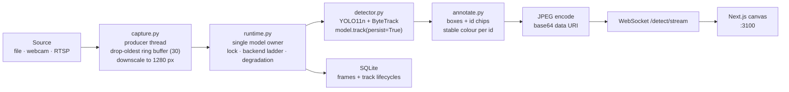

# Architecture

## Data flow



## Why the pieces are shaped this way

### Capture runs on its own thread with a bounded, drop-oldest buffer

Decoding and inference proceed independently, so a slow frame does not stall the producer. The
buffer drops the **oldest** frame when full because for a live camera a fresh frame delivered late
beats a stale frame delivered on time. Recorded files are additionally paced to their native frame
rate, so a clip plays at real speed instead of being drained as fast as the disk allows.

### Frames are downscaled at capture, not at transport

The detector letterboxes every input to `imgsz` (640 px) regardless of how large it arrives.
Carrying 1080p through inference, annotation and JPEG encoding therefore costs real time and buys
no accuracy. Capping frame width on the producer thread measured **~39% higher viewer throughput**
on 1080p sources.

### One runtime owns the model

`InferenceRuntime` is the only thing that constructs, swaps or destroys a `Detector`, all under one
lock. That is what makes changing precision mid-stream safe. Routes and the streaming loop never
touch a detector directly.

### Backends are a declarative registry

`backends.py` holds one table describing every runnable artifact: its path, device, whether it needs
a GPU, and whether its input shape is fixed. The API, the model-selector UI, the benchmark harness
and the export scripts all read that same table, so they cannot disagree about what `int8_trt`
means or where it lives.

### Loading is not proof of usability

A backend can load cleanly and still fail on execution. ONNX Runtime advertises a CUDA provider
whenever the GPU build is installed, then fails at the first bind if cuDNN is the wrong major
version. So every backend is **warmed up** as part of selection, and a warmup failure rejects it
exactly like a load failure. The failure reason is recorded per `(backend, resolution)` and shown in
the UI, rather than the interface offering an option that dies when clicked.

The key is a pair, not a bare backend name, because exported graphs bake in their input resolution:
a 640 px ONNX genuinely cannot serve 480 px, and blacklisting the whole backend for that would throw
away a working configuration.

### Degradation is a ladder, and it is exercisable

On CUDA out-of-memory:

1. If above the degraded resolution, reload the same backend at 480 px.
2. Otherwise step to the next, cheaper backend.
3. If the ladder runs out, say so.

Every step sets `degraded_mode` with a human-readable reason. `POST /config/degrade` triggers one
step on demand: a fallback path that cannot be exercised on demand cannot be trusted.

### Overlays are burned in server-side

The boxes are drawn into the JPEG rather than composited in the browser, so pixels and overlay
cannot desynchronise while frames are in flight. The client still receives the structured tracks for
the legend, and the palette in `apps/web/lib/palette.ts` mirrors `apps/api/app/annotate.py` exactly
so a legend swatch matches its box.

### Telemetry is bounded

Fixed-length deques for the time series and a capped set for unique ids. A multi-hour stream must
not grow the collector, and an unbounded metrics buffer would be the first thing to break the
no-leak requirement. The streaming loop also reads a cheap `current_fps()` rather than building a
full metrics snapshot per frame, which would run several psutil syscalls at the frame rate.

### Persistence is asynchronous and lossy by design

Telemetry writes go through a bounded queue to a dedicated thread. If the queue fills, rows are
dropped rather than back-pressuring inference. Losing a log row is acceptable; dropping a frame is
not. Only frame summaries and track lifecycles are stored, never one row per box per frame, which at
30 FPS would write millions of rows an hour for no analytical gain.

## Layout

```
apps/api/app/
  main.py          app factory, lifespan, exception handling
  config.py        settings, GPU probe, resolution policy
  backends.py      the registry and the fallback ladder
  runtime.py       model ownership, hot-swap, degradation
  detector.py      Ultralytics wrapper
  tracker.py       ByteTrack config, Results -> schemas
  capture.py       threaded source + ring buffer
  annotate.py      overlay drawing
  streaming.py     WebSocket session
  preprocess.py    decode / encode
  sources.py       video source catalogue and uploads
  metrics.py       rolling telemetry
  store.py         async SQLite writer
  models.py        Pydantic contract
  routers/         HTTP and WebSocket endpoints

apps/web/
  app/             routes: live, upload, metrics, settings
  components/      console UI
  lib/             api client, types, streaming hook, theme, palette
  e2e/             Playwright specs

ml/
  quantization/    export_engines.py, calibrate.py
  eval/            benchmark_frontier.py + reports/
  scripts/         fetch_assets.py, benchmark_inference.py
```

Phu Nguyen - HCMC, Vietnam
