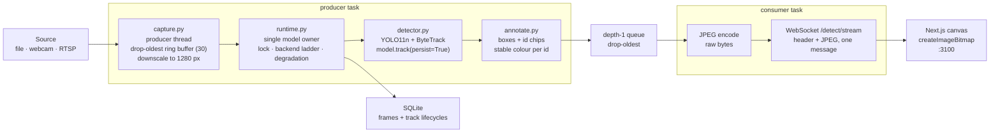

# Architecture

## Data flow



## Why the pieces are shaped this way

### Capture runs on its own thread with a bounded, drop-oldest buffer

Decoding and inference proceed independently, so a slow frame does not stall the producer. The
buffer drops the **oldest** frame when full because for a live camera a fresh frame delivered late
beats a stale frame delivered on time. Recorded files are additionally paced to their native frame
rate, so a clip plays at real speed instead of being drained as fast as the disk allows.

### Frames are downscaled at capture, not at transport

The detector letterboxes every input to `imgsz` (640 px) regardless of how large it arrives.
Carrying 1080p through inference, annotation and JPEG encoding therefore costs real time and buys
no accuracy. Capping frame width on the producer thread measured **~39% higher viewer throughput**
on 1080p sources.

### Capture+inference and encode+send are separate tasks

A single `read → infer → encode → send` loop makes the frame period the *sum* of every stage:
inference for frame N+1 cannot begin until frame N is on the wire. Splitting the pump lets those
overlap, so the period approaches the slowest stage instead.

The queue between them is depth-1 and drops the oldest pending frame. Blocking the producer would
convert backpressure into latency, and a live view must stay current rather than complete — the same
trade-off the capture ring buffer already makes upstream.

Only the consumer writes to the socket. Starlette's WebSocket is not safe to send from two tasks at
once, so a producer failure travels through the queue as an error sentinel rather than being
reported directly.

### Pixels leave as bytes, not base64

One binary message per frame carries a length-prefixed JSON header followed by the raw JPEG. Base64
inflates the payload by a third, costs an encode on the server and a decode in the browser, and the
resulting `data:` URI decodes on the main thread. None of that work moves a pixel. Keeping header
and image in a *single* message means two concurrent sends can never pair a header with the wrong
image. `?encoding=base64` still serves the older transport unchanged.

### One runtime owns the model

`InferenceRuntime` is the only thing that constructs, swaps or destroys a `Detector`, all under one
lock. That is what makes changing precision mid-stream safe. Routes and the streaming loop never
touch a detector directly.

### Backends are a declarative registry

`backends.py` holds one table describing every runnable artifact: its path, device, whether it needs
a GPU, and whether its input shape is fixed. The API, the model-selector UI, the benchmark harness
and the export scripts all read that same table, so they cannot disagree about what `int8_trt`
means or where it lives.

### Loading is not proof of usability

A backend can load cleanly and still fail on execution. ONNX Runtime advertises a CUDA provider
whenever the GPU build is installed, then fails at the first bind if cuDNN is the wrong major
version. So every backend is **warmed up** as part of selection, and a warmup failure rejects it
exactly like a load failure. The failure reason is recorded per `(backend, resolution)` and shown in
the UI, rather than the interface offering an option that dies when clicked.

The key is a pair, not a bare backend name, because exported graphs bake in their input resolution:
a 640 px ONNX genuinely cannot serve 480 px, and blacklisting the whole backend for that would throw
away a working configuration.

### Degradation is a ladder, and it is exercisable

On CUDA out-of-memory:

1. If above the degraded resolution, reload the same backend at 480 px.
2. Otherwise step to the next, cheaper backend.
3. If the ladder runs out, say so.

Every step sets `degraded_mode` with a human-readable reason. `POST /config/degrade` triggers one
step on demand: a fallback path that cannot be exercised on demand cannot be trusted.

### Overlays are burned in server-side

The boxes are drawn into the JPEG rather than composited in the browser, so pixels and overlay
cannot desynchronise while frames are in flight. The client still receives the structured tracks for
the legend, and the palette in `apps/web/lib/palette.ts` mirrors `apps/api/app/vision/annotate.py` exactly
so a legend swatch matches its box.

### Telemetry is bounded

Fixed-length deques for the time series and a capped set for unique ids. A multi-hour stream must
not grow the collector, and an unbounded metrics buffer would be the first thing to break the
no-leak requirement. The streaming loop also reads a cheap `current_fps()` rather than building a
full metrics snapshot per frame, which would run several psutil syscalls at the frame rate.

### Persistence is asynchronous and lossy by design

Telemetry writes go through a bounded queue to a dedicated thread. If the queue fills, rows are
dropped rather than back-pressuring inference. Losing a log row is acceptable; dropping a frame is
not. Only frame summaries and track lifecycles are stored, never one row per box per frame, which at
30 FPS would write millions of rows an hour for no analytical gain.

## Layout

Packages are ordered below by what they may import: each may import from those above
it and from none below. `core` depends on nothing in the app; `routers` may depend on
anything. The arrow of dependency is therefore readable from the import lines alone.

`vision` sits above `inference` because the detector parses ByteTrack results, so
`inference/detector.py` imports `vision/tracker.py` and not the reverse.

`apps/api/tests/test_package_layering.py` enforces this by parsing the imports. The
order below is not a description that can drift out of date; breaking it fails a test.

```
apps/api/app/
  main.py            app factory, lifespan, exception handling
  dependencies.py    FastAPI DI wiring

  core/              knows no domain; everything else depends on it
    config.py        settings, GPU probe, resolution policy, REPO_ROOT
    exceptions.py    the error hierarchy the handlers map to status codes
    models.py        the Pydantic contract, mirrored by apps/web/lib/types.ts

  telemetry/
    metrics.py       rolling latency/throughput window
    store.py         async SQLite writer

  vision/            per-frame work, independent of the frame's origin
    preprocess.py    decode / encode
    tracker.py       ByteTrack config, Results -> schemas
    annotate.py      overlay drawing

  inference/         the only package that touches model state
    backends.py      the registry and the fallback ladder
    detector.py      Ultralytics wrapper
    registry.py      optional MLflow artifact resolution
    runtime.py       model ownership, hot-swap, degradation

  streaming/
    capture.py       threaded source + ring buffer
    sources.py       video source catalogue and uploads
    session.py       the producer/consumer pump
    wire.py          binary frame format: [len][JSON header][JPEG]

  routers/           HTTP and WebSocket endpoints

apps/web/
  app/               routes: live, upload, metrics, settings
  components/        feature components
  components/ui/     primitives, behind an index barrel
  hooks/             use-stream.ts
  lib/               api client, types, theme, palette
  e2e/               Playwright specs

ml/
  data/              manifests + download/preparation scripts
  train/             trainer + Hydra config
  quantization/      export_engines.py, calibrate.py, benchmark_precision.py
  eval/              measurement: accuracy harnesses, throughput benchmarks,
                     live-service probes, and reports/
  tests/             guards on the conversions that fail silently
  scripts/           operator tools: fetch_assets.py, train_colab.py
```

The API package deliberately stays at `apps/api/app` rather than moving under a
`src/` layout. src-layout earns its keep for distributions that get installed; this
service is only ever run in place, and the move would invalidate `--app-dir apps/api`
and `app.main:app` everywhere they appear for no behavioural gain.

Phu Nguyen - HCMC, Vietnam
